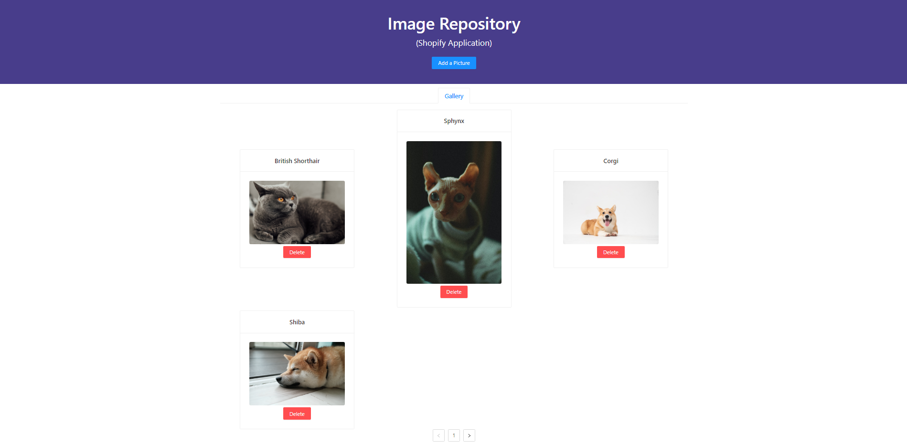

## Image Repository - Jeffrey Zhang's Shopify Application

This image repository utilizes 3 core external dependencies: React, Flask, and a local SQLite db.  
I chose this stack for its ease of demonstration and efficiency (less DB and backend boilerplate).   
(Note: the project comes with a pre-seeded database with 4 entries.)

## Features
- Efficient, custom pagination solution
  - Client only requests what needs to be shown on the page (very small DB load)
  - Each page loads 6 images at a time
  - Client caches previously loaded image metadata (name, path) in memory to minimize DB trips when revisiting previously loaded pages
  - Client updates cache when adding/deleting photos without additional DB requests
  - No external state management libraries used
- On-disk SQLite db allows for saved images to persist between refreshes
- Users can add photos (with validation) by providing a URL
- Users can delete photos
- Very fast load speeds

Here's a screenshot:


## Setup Instructions
There are set-up instructions for both the back-end (Flask) and front-end (React).

### Flask Setup
In the project directory, run:  
```bash
cd api
python -m venv venv
```  
to create a virtual environment. Then, enter the virtual environment:  
  
OS X:
`source venv/bin/activate`  
Windows:
`venv/Scripts/activate`  

Then, run `pip install -r requirements.txt` to install the required dependencies.  
Run `flask run` to start the Flask server.

### React Setup
In the project directory, run:
```bash
yarn install
yarn start
```
To install the required Node dependencies and start the React server.  
You can then visit the app at [http://localhost:3000](http://localhost:3000) to view it in the browser in dev mode.

## Testing Instructions
### `yarn test`

Launches the test runner in the interactive watch mode.\
See the section about [running tests](https://facebook.github.io/create-react-app/docs/running-tests) for more information.

## Possible Improvements
- Extend to uploading files directly (code is largely set up in a way that supports this already)
- Improve client UX (better grid responsiveness)
- Add stock + price functionality
